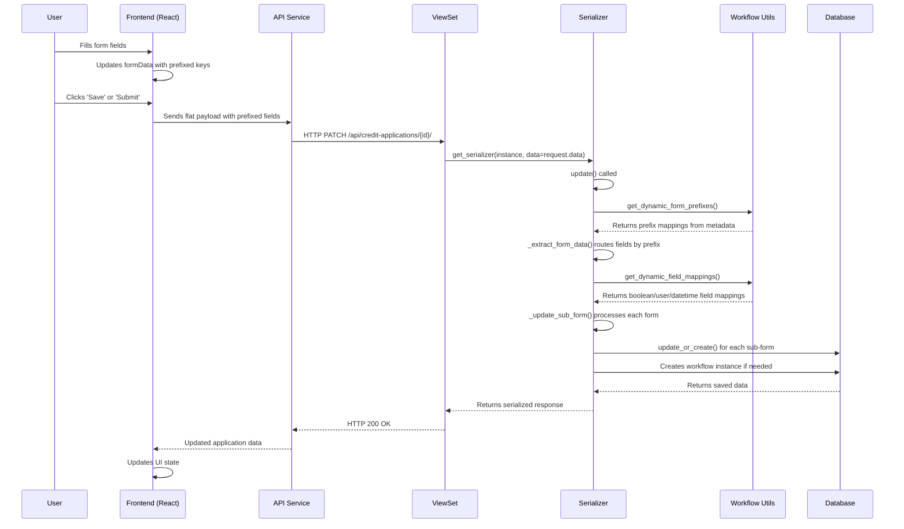

# Credit Risk Workflow System - Form Data Lifecycle

This document provides a comprehensive overview of the form data lifecycle within the Credit Risk Workflow System, detailing the journey of data from the frontend user interface to the backend database. It covers the unified, metadata-driven architecture for handling all eight forms: Credit Request, Credit Review, Business Sponsorship, Credit Questionnaire, Legal Review, Credit Analysis, Credit Compilation, and Credit Approval.

## 1. Overview of Forms in the Credit Lifecycle

As defined in the Product Requirements Document (PRD v3), the complete credit risk workflow involves several distinct forms. This document details the unified technical architecture for handling these. The key forms are:

1.  **Credit Request Form**: Initiated by the Relationship Manager to start a new credit application.
2.  **Credit Review Form**: Completed by the Credit Analyst to assess the initial request and assign resources.
3.  **Business Sponsorship Form**: Used by Business Sponsors to provide their endorsement.
4.  **Credit Questionnaire Form**: A detailed questionnaire completed by the Relationship Manager for further due diligence.
5.  **Legal Review Form**: Used by Legal Reviewers to analyze and comment on legal documentation.
6.  **Credit Analysis Form**: Completed by the Credit Analyst to record in-depth analysis and findings.
7.  **Credit Compilation Form**: Used to compile and aggregate all preceding forms into the final Credit Paper.
8.  **Credit Approval Form**: Where approvers record their decisions, conditions, and comments.

All eight forms are implemented as standalone Django models with their own workflow instances, following the metadata-driven architecture described in this document.

## 2. Component Interaction Diagram

The following diagram illustrates the typical flow of data and interactions between the major components involved in handling a form:



## 3. Guiding Principles

The form implementation is guided by the following principles to ensure consistency, maintainability, and scalability:

1.  **Metadata-Driven Architecture**: Form configuration, field mappings, and workflow behavior are defined in database metadata, not hardcoded in application code. This enables changes without code deployment.

2.  **Prefixed Field Names**: Each form uses a unique prefix (e.g., `credit_review_form_`) to namespace its fields in the flat payload, allowing the serializer to dynamically route data to the correct sub-form.

3.  **Unified State Management**: Each form utilizes a single state object (`formData`) in React to hold all its data, with prefixed field names matching the backend expectations.

4.  **Dynamic Field Processing**: The serializer automatically handles type conversions (booleans, user FKs, datetimes) based on field mappings defined in workflow metadata.

5.  **Automatic Workflow Instances**: Sub-forms automatically receive workflow instances when created, enabling independent state tracking for each form.

6.  **Dynamic Workflow Actions**: All forms use a common `WorkflowActions` component that dynamically renders buttons based on `allowed_transitions` provided by the backend.

## 4. Frontend Implementation

The frontend for each form follows a consistent structure and pattern.

### 4.1. Component Structure

Each form component is responsible for:
- Fetching the `CreditApplication` object and dropdown options on load
- Initializing a `formData` state object with **prefixed field names**
- Rendering form fields and handling user input
- Submitting data via the API service
- Displaying workflow state and available actions

### 4.2. State Management with Prefixed Fields

Form data uses prefixed field names to match the backend's dynamic routing:

```jsx
// Example: Credit Review Form component
const [formData, setFormData] = useState({
  // Fields use the form prefix for backend routing
  credit_review_form_credit_reviewer: null,
  credit_review_form_assigned_credit_analyst: null,
  credit_review_form_delegated_authority_level: '',
  credit_review_form_questionnaire_required: false,
  credit_review_form_form_started_at: null,
  // ... other prefixed fields
});

// Populate formData on initial load
useEffect(() => {
  if (data?.credit_review_form) {
    const form = data.credit_review_form;
    setFormData({
      credit_review_form_credit_reviewer: form.credit_reviewer?.id || null,
      credit_review_form_assigned_credit_analyst: form.assigned_credit_analyst?.id || null,
      credit_review_form_delegated_authority_level: form.delegated_authority_level || '',
      credit_review_form_questionnaire_required: form.questionnaire_required || false,
      // ... merge all fields from the sub-form
    });
  }
}, [data]);
```

### 4.3. Event Handling

A generic `handleChange` function handles updates for all input types:

```jsx
const handleChange = (e) => {
  const { name, value, type, checked } = e.target;
  setFormData(prevData => ({
    ...prevData,
    [name]: type === 'checkbox' ? checked : value,
  }));
};

// For Select/Autocomplete components
const handleSelectChange = (fieldName) => (event, newValue) => {
  setFormData(prevData => ({
    ...prevData,
    [fieldName]: newValue?.id || null,
  }));
};
```

### 4.4. Form Submission

The `handleSubmit` function sends the flat, prefixed payload:

```jsx
const handleSubmit = async () => {
  try {
    // formData already has prefixed keys - send directly
    const response = await api.updateCreditApplication(applicationId, formData);
    // Handle success
  } catch (error) {
    // Handle error
  }
};
```

## 5. API Service Layer

The frontend `api.js` service provides functions for interacting with credit applications:

```javascript
// frontend/src/services/api.js

// Update a credit application (handles all form data via prefixes)
export const updateCreditApplication = async (id, data) => {
  const response = await axiosInstance.patch(
    `/api/credit/credit-applications/${id}/`,
    data
  );
  return response.data;
};

// Get a single credit application with all sub-forms
export const getCreditApplication = async (id) => {
  const response = await axiosInstance.get(
    `/api/credit/credit-applications/${id}/`
  );
  return response.data;
};
```

## 6. Backend Implementation

The backend uses a metadata-driven approach to dynamically handle all form types.

### 6.1. Models

Each form is a standalone Django model linked to `CreditApplication` via `OneToOneField`:

```python
# credit_applications/models.py

class CreditApplication(models.Model):
    id = models.UUIDField(primary_key=True, default=uuid.uuid4)
    title = models.CharField(max_length=255)
    counterparty = models.ForeignKey(Counterparty, on_delete=models.PROTECT)
    workflow_instance = models.ForeignKey(WorkflowInstance, on_delete=models.SET_NULL, null=True)
    # ... other core fields

class CreditReviewForm(models.Model):
    id = models.UUIDField(primary_key=True, default=uuid.uuid4)
    credit_application = models.OneToOneField(
        CreditApplication,
        on_delete=models.CASCADE,
        related_name='credit_review_form'
    )
    workflow_instance = models.ForeignKey(WorkflowInstance, on_delete=models.SET_NULL, null=True)

    # Actual model fields (not JSONField blobs)
    credit_reviewer = models.ForeignKey(User, on_delete=models.SET_NULL, null=True)
    assigned_credit_analyst = models.ForeignKey(User, on_delete=models.SET_NULL, null=True)
    delegated_authority_level = models.CharField(max_length=10, blank=True)
    questionnaire_required = models.BooleanField(default=False)
    form_started_at = models.DateTimeField(null=True, blank=True)
    form_completed_at = models.DateTimeField(null=True, blank=True)
    # ... other fields

# Similar structure for all 8 form models:
# - CreditRequestForm
# - CreditReviewForm
# - BusinessSponsorshipForm
# - CreditQuestionnaireForm
# - LegalReviewForm
# - CreditAnalysisForm
# - CreditCompilationForm
# - CreditApprovalForm
```

### 6.2. Workflow Metadata Configuration

Form behavior is configured via JSON metadata on the `Workflow` model:

```python
# Stored in Workflow.metadata['form_metadata']
{
    "credit_review_form": {
        "title": "Credit Review Form",
        "form_key": "credit_review_form",
        "model_class": "CreditReviewForm",
        "workflow_code": "CREDIT_REVIEW",
        "field_mappings": {
            "boolean_fields": ["questionnaire_required"],
            "user_fields": ["credit_reviewer", "assigned_credit_analyst"],
            "datetime_fields": ["form_started_at", "form_completed_at"]
        }
    },
    // ... similar entries for all 8 forms
}
```

### 6.3. Dynamic Utility Functions

The `workflow_engine/utils.py` module provides metadata-driven helpers:

```python
# workflow_engine/utils.py

def get_dynamic_form_prefixes():
    """
    Returns mapping of field prefixes to form names from workflow metadata.
    Example: {'credit_review_form_': 'credit_review_form', ...}
    """
    workflow = Workflow.objects.get(code='CREDIT_PAPER')
    form_metadata = workflow.metadata.get('form_metadata', {})

    prefix_map = {}
    for form_name, config in form_metadata.items():
        form_key = config.get('form_key', form_name)
        prefix_map[f"{form_key}_"] = form_name

    return prefix_map

def get_dynamic_form_model_map():
    """
    Returns mapping of form names to Django model classes.
    Example: {'credit_review_form': CreditReviewForm, ...}
    """
    # Dynamically maps form names to model classes based on metadata

def get_dynamic_field_mappings():
    """
    Returns field type mappings for automatic conversion.
    Example: {
        'boolean_fields': {'credit_review_form': ['questionnaire_required']},
        'user_fields': {'credit_review_form': ['credit_reviewer', 'assigned_credit_analyst']},
        'datetime_fields': {'credit_review_form': ['form_started_at', 'form_completed_at']}
    }
    """
```

### 6.4. Serializer Orchestration (`CreditApplicationSerializer`)

The `CreditApplicationSerializer` uses helper methods to dynamically process all forms:

```python
# credit_applications/serializers.py

class CreditApplicationSerializer(serializers.ModelSerializer):
    # SerializerMethodField for reading sub-forms
    credit_request_form = serializers.SerializerMethodField()
    credit_review_form = serializers.SerializerMethodField()
    business_sponsorship_form = serializers.SerializerMethodField()
    # ... all 8 forms

    def get_credit_review_form(self, obj):
        """Auto-initializes form if needed, returns serialized data."""
        return self._get_or_auto_initialize_form(
            obj, 'credit_review_form', CreditReviewForm, CreditReviewFormSerializer
        )

    def _extract_form_data(self, data):
        """
        Extracts and groups form data from flat payload based on dynamic prefixes.

        Input:  {'credit_review_form_credit_reviewer': 'uuid-123', ...}
        Output: {'credit_review_form': {'credit_reviewer': 'uuid-123'}, ...}
        """
        from workflow_engine.utils import get_dynamic_form_prefixes

        prefix_map = get_dynamic_form_prefixes()
        form_groups = {form_name: {} for form_name in prefix_map.values()}

        for key, value in data.items():
            for prefix, form_type in prefix_map.items():
                if key.startswith(prefix):
                    field_name = key[len(prefix):]  # Remove prefix
                    form_groups[form_type][field_name] = value

        return form_groups

    def _update_sub_form(self, instance, form_type, form_data):
        """
        Updates or creates a sub-form with automatic field processing.
        """
        from workflow_engine.utils import get_dynamic_form_model_map, get_dynamic_field_mappings

        model_map = get_dynamic_form_model_map()
        model_class = model_map.get(form_type)
        if not model_class or not form_data:
            return

        # Get field mappings from metadata
        field_mappings = get_dynamic_field_mappings()

        # Convert boolean strings to actual booleans
        if form_type in field_mappings['boolean_fields']:
            form_data = self._convert_booleans(
                form_data,
                field_mappings['boolean_fields'][form_type]
            )

        # Resolve user UUID strings to User objects
        if form_type in field_mappings['user_fields']:
            form_data = self._resolve_user_fields(
                form_data,
                field_mappings['user_fields'][form_type]
            )

        # Handle datetime fields with timezone awareness
        if form_type in field_mappings['datetime_fields']:
            for field in field_mappings['datetime_fields'][form_type]:
                if field in form_data and form_data[field]:
                    form_data[field] = self._parse_datetime(form_data[field])

        # Create or update the sub-form
        sub_form, created = model_class.objects.update_or_create(
            credit_application=instance,
            defaults=form_data
        )

        # Create workflow instance for the sub-form if needed
        if not sub_form.workflow_instance:
            self._create_workflow_instance(sub_form, form_type)

        return sub_form

    def _convert_booleans(self, data, boolean_fields, nullable_fields=None):
        """Convert string booleans ('yes', 'true', 'no', 'false') to Python booleans."""
        for field in boolean_fields:
            if field in data:
                value = data[field]
                if isinstance(value, str):
                    data[field] = value.lower() in ('true', 'yes', 'y', '1')
        return data

    def _resolve_user_fields(self, data, user_fields):
        """Convert user UUID strings to User model instances."""
        for field in user_fields:
            if field in data and data[field]:
                try:
                    data[field] = User.objects.get(id=data[field])
                except User.DoesNotExist:
                    data[field] = None
        return data

    @transaction.atomic
    def update(self, instance, validated_data):
        """
        Main update method that orchestrates all sub-form updates.
        """
        # Extract form data grouped by prefix
        form_updates = self._extract_form_data(self.initial_data)

        # Update parent CreditApplication
        instance = super().update(instance, validated_data)

        # Update each sub-form that has data
        for form_type, form_data in form_updates.items():
            if form_data:
                self._update_sub_form(instance, form_type, form_data)

        return instance
```

### 6.5. Sub-Form Serializers

Each sub-form has its own serializer for reading data:

```python
class CreditReviewFormSerializer(serializers.ModelSerializer):
    workflow_instance = serializers.SerializerMethodField()
    available_transitions = serializers.SerializerMethodField()

    def get_workflow_instance(self, obj):
        """Return workflow instance details."""
        if obj.workflow_instance:
            return {
                'id': str(obj.workflow_instance.id),
                'current_state': obj.workflow_instance.current_state.name,
                'workflow_definition': obj.workflow_instance.workflow.name
            }
        return None

    def get_available_transitions(self, obj):
        """Return transitions available to the current user."""
        request = self.context.get('request')
        user = request.user if request else None
        if not user or not obj.workflow_instance:
            return []

        transitions = obj.workflow_instance.get_allowed_transitions(user)
        return [
            {'code': t.code, 'name': t.name, 'metadata': t.metadata}
            for t in transitions
        ]

    class Meta:
        model = CreditReviewForm
        fields = '__all__'
```

## 7. Data Flow Summary

### 7.1. Write Path (Frontend → Database)

1. **Frontend**: User fills form fields with prefixed names
   ```
   credit_review_form_credit_reviewer: "user-uuid-123"
   ```

2. **API Call**: Flat JSON payload sent to `/api/credit/credit-applications/{id}/`

3. **Serializer**: `_extract_form_data()` routes by prefix:
   ```python
   {'credit_review_form': {'credit_reviewer': 'user-uuid-123'}}
   ```

4. **Field Processing**: `_update_sub_form()` applies type conversions from metadata

5. **Database**: `update_or_create()` saves to `CreditReviewForm` table

### 7.2. Read Path (Database → Frontend)

1. **Serializer**: `SerializerMethodField` calls `get_credit_review_form()`

2. **Auto-Initialize**: If form doesn't exist, `_get_or_auto_initialize_form()` creates it

3. **Sub-Serializer**: `CreditReviewFormSerializer` serializes the form with workflow data

4. **Response**: Nested structure returned:
   ```json
   {
     "id": "app-uuid",
     "credit_review_form": {
       "credit_reviewer": {"id": "user-uuid", "name": "John Doe"},
       "workflow_instance": {"current_state": "Draft"},
       "available_transitions": [{"code": "CR_SUBMIT", "name": "Submit"}]
     }
   }
   ```

5. **Frontend**: Extracts and populates `formData` with prefixed keys

## 8. Related Documentation

- [Metadata-Driven Workflow System](../architecture/metadata-driven-workflow-system.md) - Detailed metadata architecture
- [Workflow Engine Implementation](./Credit-Risk-Workflow-Engine-Implementation.md) - Workflow state management
- [API Service Implementation](./Credit-Risk-API-Service-Implementation.md) - API endpoint details
