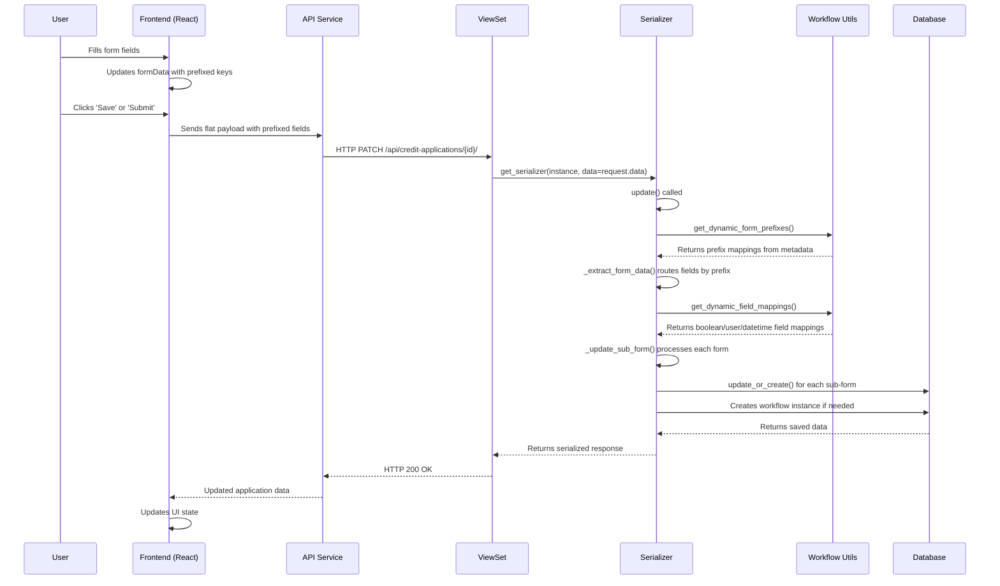

# Credit Risk Workflow System - Serializer Implementation

This document describes the serialization architecture for the Credit Risk Workflow System, focusing on the `CreditApplicationSerializer` and its handling of sub-forms.

## 1. Conceptual Overview

### What is Serialization?

In the context of web APIs, **serialization** is the process of converting complex data structures (like Django model instances) into formats that can be easily transmitted over HTTP (typically JSON). **Deserialization** is the reverse process - converting incoming JSON payloads back into Python objects that can be saved to the database.

In Django REST Framework, serializers serve as the bridge between:
- **Database models** (Python objects with complex relationships)
- **API responses** (JSON data sent to the frontend)
- **API requests** (JSON data received from the frontend)

### Role in the Architecture

The serializer is the central orchestration point for all form data operations:

```
┌─────────────────────────────────────────────────────────────────────────────┐
│                           SYSTEM ARCHITECTURE                               │
├─────────────────────────────────────────────────────────────────────────────┤
│                                                                             │
│   ┌──────────────┐     ┌──────────────┐     ┌──────────────────────────┐    │
│   │   Frontend   │────▶│   ViewSet    │────▶│       SERIALIZER         │    │
│   │   (React)    │     │   (DRF)      │     │                          │    │
│   └──────────────┘     └──────────────┘     │  • Data transformation   │    │
│         ▲                                   │  • Field routing         │    │
│         │                                   │  • Validation            │    │
│         │              ┌──────────────┐     │  • Workflow integration  │    │
│         └──────────────│   Response   │◀────│                          │    │
│                        │   (JSON)     │     └───────────┬──────────────┘    │
│                        └──────────────┘                 │                   │
│                                                         ▼                   │
│                        ┌──────────────┐     ┌──────────────────────────┐    │
│                        │   Workflow   │◀───▶│       DATABASE           │    │
│                        │   Metadata   │     │                          │    │
│                        └──────────────┘     │  • CreditApplication     │    │
│                                             │  • 8 Sub-Form Models     │    │
│                                             │  • WorkflowInstances     │    │
│                                             └──────────────────────────┘    │
│                                                                             │
└─────────────────────────────────────────────────────────────────────────────┘
```

### Key Responsibilities

The `CreditApplicationSerializer` handles:

1. **Data Routing**: Directs prefixed fields to the correct sub-form models
2. **Type Conversion**: Converts string booleans, resolves user UUIDs, parses datetimes
3. **Auto-Initialization**: Creates forms on-demand based on workflow state
4. **Workflow Integration**: Creates and manages workflow instances for forms
5. **Permission Checking**: Determines which forms users can edit
6. **Response Assembly**: Builds nested JSON responses with workflow information

### Data Flow



## 2. Architecture Overview

The serializer uses a **hybrid read/write strategy** with a **metadata-driven architecture**:

- **Read (GET)**: Uses `SerializerMethodField` getters that auto-initialize forms on demand
- **Write (POST/PUT)**: Accepts flat, prefixed payloads that are dynamically routed to sub-forms

This approach is fully extensible - adding new forms only requires workflow metadata configuration, not code changes.

## 3. Metadata-Driven Design

The serializer relies on workflow metadata utilities rather than hardcoded mappings:

| Utility Function | Purpose | Location |
|------------------|---------|----------|
| `get_dynamic_form_prefixes()` | Maps field prefixes to form types | `workflow_engine/utils.py` |
| `get_dynamic_form_model_map()` | Maps form type names to Django model classes | `workflow_engine/utils.py` |
| `get_dynamic_field_mappings()` | Returns boolean, user, and datetime field lists per form | `workflow_engine/utils.py` |
| `get_form_metadata()` | Returns form title, key, and other metadata | `workflow_engine/utils.py` |
| `get_relevant_sub_processes_for_state()` | Returns forms relevant for a workflow state | `workflow_engine/utils.py` |
| `auto_initialize_forms_for_state()` | Creates forms on-demand based on workflow state | `workflow_engine/utils.py` |
| `can_user_edit_form()` | Checks if user can edit a form based on role/state | `workflow_engine/utils.py` |

### Form Models

The system has 8 sub-form models, each with their own workflow instance:

| Form Model | Prefix | Workflow Code |
|------------|--------|---------------|
| CreditRequestForm | `credit_request_` | CREDIT_REQUEST |
| CreditReviewForm | `credit_review_` | CREDIT_REVIEW |
| BusinessSponsorshipForm | `business_sponsorship_` | BUSINESS_SPONSORSHIP |
| LegalReviewForm | `legal_review_` | LEGAL_REVIEW |
| CreditQuestionnaireForm | `credit_questionnaire_` | CREDIT_QUESTIONNAIRE |
| CreditAnalysisForm | `credit_analysis_` | CREDIT_ANALYSIS |
| CreditCompilationForm | `credit_compilation_` | CREDIT_COMPILATION |
| CreditApprovalForm | `credit_approval_` | CREDIT_APPROVAL |

## 4. Read Path (GET Responses)

### SerializerMethodField Pattern

Each sub-form is exposed via a `SerializerMethodField` with a getter method:

```python
class CreditApplicationSerializer(serializers.ModelSerializer):
    credit_request_form = serializers.SerializerMethodField()
    credit_review_form = serializers.SerializerMethodField()
    business_sponsorship_form = serializers.SerializerMethodField()
    legal_review_form = serializers.SerializerMethodField()
    credit_questionnaire_form = serializers.SerializerMethodField()
    credit_analysis_form = serializers.SerializerMethodField()
    credit_compilation_form = serializers.SerializerMethodField()
    credit_approval_form = serializers.SerializerMethodField()

    def get_credit_request_form(self, obj):
        return self._get_or_auto_initialize_form(
            obj, 'credit_request_form', CreditRequestForm, CreditRequestFormSerializer
        )
```

### Auto-Initialization

Forms are automatically created when accessed if they don't exist:

```python
def _get_or_auto_initialize_form(self, obj, form_name, model_class, serializer_class):
    try:
        form = getattr(obj, form_name)
        serializer = serializer_class(form, context=self.context)
        return serializer.data
    except model_class.DoesNotExist:
        # Auto-initialize using workflow state metadata
        from workflow_engine.utils import auto_initialize_forms_for_state
        initialized_forms = auto_initialize_forms_for_state(obj)
        if form_name in initialized_forms:
            form = initialized_forms[form_name]
            serializer = serializer_class(form, context=self.context)
            return serializer.data
        return None
```

### Response Structure

GET responses include nested form data with workflow information:

```json
{
  "id": "uuid",
  "reference_number": "CR-2025-0001",
  "title": "Application Title",
  "workflow_state": {
    "id": "uuid",
    "name": "Credit Request In Progress",
    "code": "CREDIT_REQUEST_IN_PROGRESS",
    "metadata": {}
  },
  "available_transitions": [
    {"code": "CR_TR_4", "name": "Submit", "description": "..."}
  ],
  "credit_request_form": {
    "id": "uuid",
    "workflow_instance": {
      "id": "uuid",
      "current_state": "Draft",
      "workflow_definition": "Credit Request"
    },
    "available_transitions": [...],
    "counterparty_cif": "12345",
    "guarantor_name": "...",
    "country_risk_limit_available": true
  },
  "sub_processes": [
    {
      "form_name": "Credit Request",
      "form_key": "CreditRequestForm",
      "can_edit": true,
      "data": {...}
    }
  ],
  "limit_requests": [...]
}
```

## 5. Write Path (POST/PUT Requests)

### Flat Prefixed Payload Structure

The frontend sends form data as flat fields with prefixes:

```json
{
  "title": "New Application",
  "counterparty_id": "uuid",
  "credit_request_counterparty_cif": "12345",
  "credit_request_guarantor_name": "Guarantor Corp",
  "credit_request_country_risk_limit_available": "true",
  "credit_review_risk_rating": "A",
  "credit_review_approved": "yes",
  "limit_requests": [
    {
      "limit_type_id": "uuid",
      "existing_amount": 1000000,
      "proposed_amount": 2000000
    }
  ]
}
```

### Form Data Extraction

The `_extract_form_data()` method dynamically extracts prefixed fields:

```python
def _extract_form_data(self, data):
    from workflow_engine.utils import get_dynamic_form_prefixes

    # Get prefix mapping from workflow metadata
    prefix_map = get_dynamic_form_prefixes()
    # Returns: {'credit_request_': 'credit_request_form', ...}

    form_groups = {form_name: {} for form_name in prefix_map.values()}

    for key, value in data.items():
        for prefix, form_type in prefix_map.items():
            if key.startswith(prefix):
                field_name = key[len(prefix):]  # Remove prefix
                form_groups[form_type][field_name] = value

    return form_groups
```

### Sub-Form Update

The `_update_sub_form()` method handles saving with special field processing:

```python
def _update_sub_form(self, instance, form_type, form_data):
    from workflow_engine.utils import get_dynamic_form_model_map, get_dynamic_field_mappings

    # Get model class dynamically
    model_map = get_dynamic_form_model_map()
    model_class = model_map.get(form_type)

    # Get field mappings for transformations
    field_mappings = get_dynamic_field_mappings()

    # Convert boolean strings to Python booleans
    if form_type in field_mappings['boolean_fields']:
        form_data = self._convert_booleans(form_data, field_mappings['boolean_fields'][form_type])

    # Resolve user foreign key fields
    user_fields_to_process = self._get_user_fields_for_form(form_type)
    if user_fields_to_process:
        form_data = self._resolve_user_fields(form_data, user_fields_to_process)

    # Handle datetime fields
    if form_type in field_mappings['datetime_fields']:
        # Make datetime fields timezone-aware
        ...

    # Save the form
    form_data['form_last_saved_at'] = timezone.now()
    sub_form_instance, created = model_class.objects.update_or_create(
        credit_application=instance,
        defaults=form_data
    )

    # Auto-create workflow instance if needed
    if not sub_form_instance.workflow_instance:
        self._create_workflow_sub_instance(sub_form_instance, model_class)
```

## 6. Helper Methods

### Boolean Conversion

`_convert_booleans()` handles string-to-boolean conversion:

```python
def _convert_booleans(self, data, boolean_fields, nullable_fields=None):
    """
    Converts string values to Python booleans.

    Accepts: 'true', 'yes', 'y', '1' → True
             'false', 'no', 'n', '0' → False
             '' (empty) → None (nullable) or False (non-nullable)
    """
    for field in boolean_fields:
        if field in data:
            value = data[field]
            if isinstance(value, str):
                value = value.lower().strip()
                if value in ('true', 'yes', 'y', '1'):
                    data[field] = True
                elif value in ('false', 'no', 'n', '0'):
                    data[field] = False
                elif value == '':
                    data[field] = None if field in nullable_fields else False
    return data
```

### User Field Resolution

`_resolve_user_fields()` converts user UUIDs to User instances:

```python
def _resolve_user_fields(self, data, user_fields):
    """Resolves user foreign keys from UUID strings to User objects."""
    for field in user_fields:
        if field in data and data[field]:
            if hasattr(data[field], '_meta'):  # Already a User instance
                continue
            try:
                user = User.objects.get(id=data[field])
                data[field] = user
            except User.DoesNotExist:
                data[field] = None
    return data
```

**User fields per form:**

| Form Type | User Fields |
|-----------|-------------|
| credit_request_form | `senior_business_sponsor_id`, `second_business_sponsor_id` |
| credit_review_form | `credit_reviewer`, `assigned_credit_analyst` |
| business_sponsorship_form | `senior_business_sponsor`, `second_business_sponsor` |
| legal_review_form | `legal_reviewer` |
| credit_questionnaire_form | `questionnaire_completor` |
| credit_analysis_form | `credit_analyst` |
| credit_compilation_form | `compiler` |
| credit_approval_form | `approver` |

### Date Field Resolution

`_resolve_date_fields()` normalizes date formats:

```python
def _resolve_date_fields(self, data, date_fields):
    """
    Normalizes date formats to YYYY-MM-DD.

    Handles: '', '**', '*', None → None
    Supports: YYYY-MM-DD, DD/MM/YYYY, MM/DD/YYYY, ISO format
    """
```

### Datetime Field Handling

Datetime fields are made timezone-aware:

```python
# If datetime string has no timezone info
if 'T' in dt_str and not any(x in dt_str for x in ['Z', '+', '-']):
    # Append seconds if needed
    if len(dt_str.split('T')[1].split(':')) < 3:
        dt_str = f"{dt_str}:00"
    naive_dt = timezone.datetime.fromisoformat(dt_str)
    form_data[field] = timezone.make_aware(naive_dt)
else:
    # Handle ISO format with Z or timezone offset
    dt_str = dt_str.replace('Z', '+00:00')
    dt = timezone.datetime.fromisoformat(dt_str)
    form_data[field] = dt
```

## 7. Workflow Integration

### Sub-Workflow Creation

Each sub-form automatically gets its own workflow instance. The workflow code is derived from the model name:

```python
# CreditRequestForm → CREDIT_REQUEST
model_name = model_class.__name__  # e.g., 'CreditRequestForm'
base_name = model_name[:-4]  # Remove 'Form' → 'CreditRequest'
# Convert CamelCase to UPPER_SNAKE_CASE
workflow_code = re.sub('([a-z0-9])([A-Z])', r'\1_\2', base_name).upper()
# Result: 'CREDIT_REQUEST'

sub_wf_def = Workflow.objects.get(code=workflow_code)
sub_initial_state = State.objects.get(workflow=sub_wf_def, is_initial=True)

sub_wf_instance = WorkflowInstance.objects.create(
    workflow=sub_wf_def,
    current_state=sub_initial_state,
    content_type=ContentType.objects.get_for_model(sub_form_instance),
    object_id=sub_form_instance.id
)
sub_form_instance.workflow_instance = sub_wf_instance
sub_form_instance.save(update_fields=['workflow_instance'])
```

### Available Transitions

Each form serializer exposes available transitions based on user role:

```python
def get_available_transitions(self, obj):
    request = self.context.get('request')
    user = request.user if request else None
    if not user or not obj.workflow_instance:
        return []

    transitions = obj.workflow_instance.get_allowed_transitions(user)
    return [
        {
            'code': t.code,
            'name': t.name,
            'description': t.description,
            'metadata': t.metadata
        }
        for t in transitions
    ]
```

### Permission Checking

`_can_user_edit_form()` uses metadata-driven permission checking:

```python
def _can_user_edit_form(self, credit_app, form_name, form_instance):
    request = self.context.get('request')
    if not request or not request.user:
        return False

    from workflow_engine.utils import can_user_edit_form
    return can_user_edit_form(request.user, credit_app, form_name, form_instance)
```

### Sub-Processes Response

The `get_sub_processes()` method returns forms relevant to the current workflow state:

```python
def get_sub_processes(self, obj):
    from workflow_engine.utils import get_relevant_sub_processes_for_state, get_form_metadata

    current_state_code = obj.workflow_instance.current_state.code
    form_list = get_relevant_sub_processes_for_state(current_state_code)

    sub_processes_data = []
    for form_name in form_list:
        form_metadata = get_form_metadata(form_name)
        form_instance = getattr(obj, form_name, None)
        can_edit = self._can_user_edit_form(obj, form_name, form_instance)

        sub_processes_data.append({
            'form_name': form_metadata['title'],
            'form_key': form_metadata['form_key'],
            'can_edit': can_edit,
            'data': serialized_form_data or None
        })

    return sub_processes_data
```

## 8. Create and Update Flow

### Create (POST)

1. Extract limit requests from payload
2. Extract all prefixed form data via `_extract_form_data()`
3. Set `created_by` from request user
4. Create parent `CreditApplication` with non-prefixed fields
5. Loop through form data and call `_update_sub_form()` for each
6. Create limit requests
7. Create parent workflow instance (CREDIT_PAPER workflow)

```python
@transaction.atomic
def create(self, validated_data):
    # Extract limit requests
    limit_requests_payload = self.initial_data.get('limit_requests', [])
    validated_data.pop('limit_requests', None)

    # Set created_by
    request = self.context.get('request')
    if request and hasattr(request, 'user'):
        validated_data['created_by'] = request.user

    # Extract form data
    form_updates = self._extract_form_data(self.initial_data)

    # Create parent application
    credit_application = super().create(validated_data)

    # Create sub-forms
    for form_type, form_data in form_updates.items():
        if form_data:
            self._update_sub_form(credit_application, form_type, form_data)

    # Create limit requests
    # ...

    # Create workflow instance
    workflow = Workflow.objects.get(name='Credit Paper Approval Workflow')
    initial_state = State.objects.get(workflow=workflow, is_initial=True)
    wf_instance = WorkflowInstance.objects.create(
        workflow=workflow,
        content_object=credit_application,
        current_state=initial_state
    )
    credit_application.workflow_instance = wf_instance
    credit_application.save(update_fields=['workflow_instance'])

    return credit_application
```

### Update (PUT/PATCH)

1. Extract limit requests from payload
2. Extract all prefixed form data via `_extract_form_data()`
3. Update parent `CreditApplication` fields
4. Loop through form data and call `_update_sub_form()` for each
5. Replace limit requests (wholesale replacement strategy)

```python
@transaction.atomic
def update(self, instance, validated_data):
    # Extract payloads
    limit_requests_payload = self.initial_data.get('limit_requests', [])
    validated_data.pop('limit_requests', None)
    form_updates = self._extract_form_data(self.initial_data)

    # Update parent
    instance = super().update(instance, validated_data)

    # Update sub-forms
    for form_type, form_data in form_updates.items():
        if form_data:
            self._update_sub_form(instance, form_type, form_data)

    # Replace limit requests
    if limit_requests_payload is not None:
        instance.limit_requests.all().delete()
        for lr_data in limit_requests_payload:
            # Create new limit requests
            ...

    return instance
```

## 9. Limit Requests Handling

Limit requests are handled separately as a one-to-many relationship:

```python
limit_requests = LimitRequestSerializer(many=True, required=False)
```

The frontend sends limit requests as a separate array:

```json
{
  "limit_requests": [
    {
      "limit_type_id": "uuid",
      "existing_amount": 1000000,
      "existing_tenor": 12,
      "proposed_amount": 2000000,
      "proposed_tenor": 24,
      "comments": "Increase due to expansion"
    }
  ]
}
```

Updates use wholesale replacement - all existing limits are deleted and replaced.

## 10. Key Files

| File | Purpose |
|------|---------|
| `credit_applications/serializers.py` | Main serializer implementation |
| `credit_applications/models.py` | Form model definitions |
| `workflow_engine/utils.py` | Metadata utility functions |
| `workflow_engine/models.py` | Workflow, State, Transition models |

## 11. Adding New Forms

To add a new form type:

1. Create the Django model in `credit_applications/models.py`
2. Create a serializer class in `credit_applications/serializers.py`
3. Add workflow metadata (Workflow, States, Transitions) to the database
4. Update workflow metadata for `get_dynamic_form_prefixes()` mapping
5. Update workflow metadata for `get_dynamic_form_model_map()` mapping
6. Add `SerializerMethodField` and getter to `CreditApplicationSerializer`
7. Add to serializer map in `get_sub_processes()`

The core serialization logic (`_extract_form_data`, `_update_sub_form`) requires no changes.

## 12. Benefits of This Approach

1. **Metadata-Driven**: Form handling configured via database, not code
2. **Auto-Initialization**: Forms created on-demand based on workflow state
3. **Hybrid Read/Write**: Clean nested responses, simple flat payloads
4. **Extensible**: Adding forms requires minimal code changes
5. **Workflow Integration**: Each form has its own workflow instance
6. **Permission-Aware**: Edit permissions driven by workflow metadata

## 13. Related Documentation

- [Credit-Risk-Form-Lifecycle](./Credit-Risk-Form-Lifecycle.md) - End-to-end form data flow
- [Credit-Risk-Workflow-Engine-Implementation](./Credit-Risk-Workflow-Engine-Implementation.md) - Workflow system details
- [Metadata-Driven Workflow System](../architecture/metadata-driven-workflow-system.md) - Architecture overview
