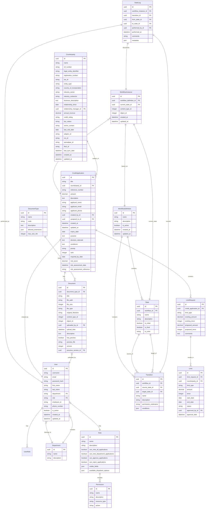

```mermaid

erDiagram
    User ||--o{ UserRole : has
    User }|--|| Department : belongs_to
    User }|--|| Role : has
    Role ||--o{ Permission : includes
    
    Department ||--o{ User : contains
    
    WorkflowDefinition ||--o{ State : contains
    WorkflowDefinition ||--o{ Transition : contains
    State ||--o{ Transition : source_of
    State ||--o{ Transition : target_of
    
    WorkflowInstance ||--|| WorkflowDefinition : based_on
    WorkflowInstance ||--|| State : current_state
    WorkflowInstance }o--|| CreditApplication : attached_to
    
    StateLog ||--|| WorkflowInstance : documents
    StateLog ||--|| Transition : records
    StateLog ||--|| User : performed_by
    
    Counterparty ||--o{ CreditApplication : subject_of
    
    CreditApplication ||--|| User : created_by
    CreditApplication ||--o{ Document : has
    CreditApplication ||--o{ LimitRequest : contains
    
    DocumentType ||--o{ Document : categorizes
    Document }|--|| User : uploaded_by
    
    LimitRequest ||--o{ Limit : results_in
    
    User {
        uuid id PK
        string username
        string email
        string password_hash
        string first_name
        string last_name
        string department FK
        string role FK
        string employee_id
        string phone_number
        boolean is_active
        datetime created_at
        datetime updated_at
    }
    
    Department {
        uuid id PK
        string name
        string description
    }
    
    Role {
        uuid id PK
        string name
        string description
        boolean can_view_all_applications
        boolean can_view_department_applications
        boolean can_approve_applications
        boolean can_reject_applications
        json visible_fields
        json available_dropdown_options
    }
    
    Permission {
        uuid id PK
        string name
        string description
        string resource_type
        string action
    }
    
    WorkflowDefinition {
        uuid id PK
        string name
        string description
        boolean is_active
        datetime created_at
        datetime updated_at
    }
    
    State {
        uuid id PK
        uuid workflow_id FK
        string name
        string description
        boolean is_initial
        boolean is_final
        string ui_color
    }
    
    Transition {
        uuid id PK
        uuid workflow_id FK
        uuid source_state_id FK
        uuid target_state_id FK
        string name
        string description
        string permission_codename
        json conditions
    }
    
    WorkflowInstance {
        uuid id PK
        uuid workflow_definition_id FK
        uuid current_state_id FK
        integer content_type_id
        integer object_id
        datetime created_at
        datetime updated_at
    }
    
    StateLog {
        uuid id PK
        uuid workflow_instance_id FK
        uuid transition_id FK
        uuid from_state_id FK
        uuid to_state_id FK
        uuid performed_by_id FK
        datetime performed_at
        string comments
        json metadata
    }
    
    Counterparty {
        uuid id PK
        string name
        string cif_number
        string legal_entity_identifier
        string registration_number
        string tax_id
        string entity_type
        string country_of_incorporation
        string industry_sector
        string industry_subsector
        text business_description
        date relationship_since
        uuid relationship_manager_id FK
        decimal annual_revenue
        string credit_rating
        string kyc_status
        string senior_contact
        date last_visit_date
        string adaptiv_id
        string crs_id
        string spreadpac_id
        string fitch_id
        datetime last_sync_date
        datetime created_at
        datetime updated_at
    }
    
    DocumentType {
        uuid id PK
        string name
        string code
        text description
        json allowed_extensions
        integer max_size_mb
    }
    
    Document {
        uuid id PK
        uuid document_type_id FK
        string title
        string file_path
        integer file_size
        string file_type
        string original_filename
        integer content_type_id
        integer object_id
        uuid uploaded_by_id FK
        datetime upload_date
        text description
        boolean has_preview
        string preview_file
        integer version
        uuid previous_version_id FK
    }
    
    CreditApplication {
        uuid id PK
        string title
        uuid counterparty_id FK
        string reference_number
        decimal amount
        text description
        string applicant_name
        string applicant_email
        string applicant_phone
        uuid created_by_id FK
        uuid assigned_to_id FK
        datetime created_at
        datetime updated_at
        date expiry_date
        text purpose
        text decision_rationale
        text conditions
        string priority
        integer rank
        date required_by_date
        decimal risk_score
        datetime risk_assessment_date
        string risk_assessment_reference
    }
    
    LimitRequest {
        uuid id PK
        uuid credit_application_id FK
        string limit_type
        decimal existing_amount
        integer existing_tenor
        decimal proposed_amount
        integer proposed_tenor
        text comments
    }
    
    Limit {
        uuid id PK
        uuid limit_request_id FK
        uuid counterparty_id FK
        string limit_type
        decimal amount
        integer tenor
        date start_date
        date end_date
        string status
        uuid approved_by_id FK
        datetime approval_date
    }
```

