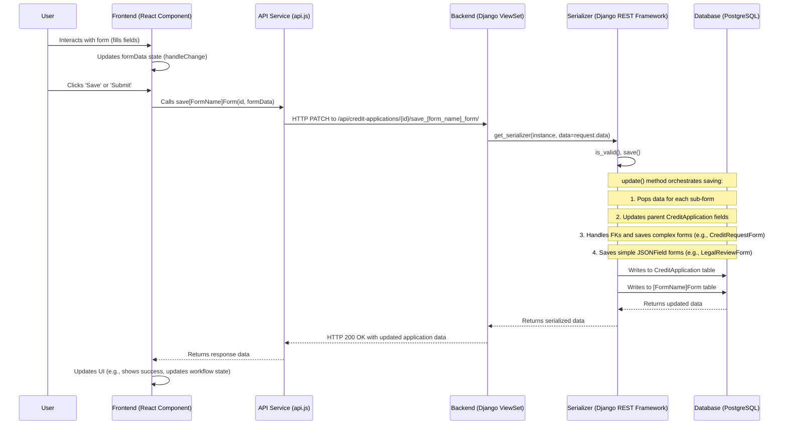

# Credit Risk Workflow System - Form Data Lifecycle

This document provides a comprehensive overview of the form data lifecycle within the Credit Risk Workflow System, detailing the journey of data from the frontend user interface to the backend database. It covers the unified architecture for handling all major forms, including the Credit Request, Business Sponsorship, Credit Questionnaire, and Legal Review forms.

## 1. Overview of Forms in the Credit Lifecycle

As defined in the Product Requirements Document (PRD v3), the complete credit risk workflow involves several distinct forms and data collection stages. This document details the unified technical architecture for handling these. The key forms and stages are:

1.  **Credit Request Form**: Initiated by the Relationship Manager to start a new credit application.
2.  **Credit Review Form**: Completed by the Credit Analyst to assess the initial request.
3.  **Business Sponsorship Form**: Used by Business Sponsors to provide their endorsement.
4.  **Credit Questionnaire Form**: A detailed questionnaire completed by the Relationship Manager for further due diligence.
5.  **Legal Review Form**: Used by Legal Reviewers to analyze and comment on legal documentation.
6.  **Credit Analysis Stage**: While not a standalone form, this involves the Credit Analyst performing in-depth analysis and recording findings, which contribute to the Credit Paper.
7.  **Credit Paper Compilation**: The aggregation of all preceding forms and analyses into a final document.
8.  **Credit Approval Stage**: Where final approvers record their decisions, conditions, and comments.

This lifecycle document primarily focuses on the technical implementation pattern common to the fillable forms (1-5, and parts of 6 and 8 that involve structured data entry).

## 2. Component Interaction Diagram

The following diagram illustrates the typical flow of data and interactions between the major components involved in handling a form:



## 3. Guiding Principles

The form implementation is guided by the following principles to ensure consistency, maintainability, and scalability:

1.  **Unified State Management**: Each form utilizes a single state object (`formData`) in React to hold all its data, simplifying state updates and data handling.
2.  **Generic Event Handlers**: Reusable `handleChange` functions dynamically update the `formData` object based on user input, reducing boilerplate code.
3.  **Flat Data Payload**: The frontend sends a single, flat JSON object to the backend for saving. There is no complex nesting of `form_data` objects in the payload.
4.  **Serializer-Led Orchestration**: The backend's `CreditApplicationSerializer` is the single point of entry for all form data. It is responsible for validating the incoming flat payload and orchestrating the creation or update of the primary `CreditApplication` and all its related sub-form models (e.g., `CreditRequestForm`, `BusinessSponsorshipForm`).
5.  **Dynamic Workflow Actions**: All forms use a common `WorkflowActions` component (or a similar pattern) that dynamically renders buttons based on the `allowed_transitions` provided by the backend, ensuring a consistent user experience for workflow progression.

## 4. Frontend Implementation

The frontend for each form follows a consistent structure and pattern.

### 4.1. Component Structure

Each form (e.g., `CreditRequestForm/index.jsx`) is responsible for:
- Fetching all necessary data on load (e.g., the `CreditApplication` object, dropdown options).
- Initializing a single `formData` state object.
- Rendering the form fields and passing them the `formData` and a `handleChange` function.
- Handling form submission via a generic `handleSubmit` function.
- Managing and displaying the workflow state and available actions.

### 4.2. State Management

A single `useState` hook manages all data for the form.

```jsx
// Example from a generic form component
const [formData, setFormData] = useState({
  // Direct fields from CreditApplication model
  title: '',
  counterparty_id: null,
  // Fields from the specific sub-form model (e.g., CreditRequestForm)
  senior_business_sponsor_id: null,
  // ... and so on for all fields on the form
});

// Populate formData on initial load
useEffect(() => {
  if (data) { // data fetched from API
    setFormData({
      title: data.title || '',
      counterparty_id: data.counterparty_id || null,
      senior_business_sponsor_id: data.credit_request_form?.senior_business_sponsor_id || null,
      // ... merge data from the main application and the relevant sub-form
    });
  }
}, [data]);
```

### 4.3. Event Handling

A generic `handleChange` function handles updates for all input types.

```jsx
const handleChange = (e) => {
  const { name, value, type, checked } = e.target;
  setFormData(prevData => ({
    ...prevData,
    [name]: type === 'checkbox' ? checked : value,
  }));
};
```

### 4.4. Form Submission (`handleSubmit`)

The `handleSubmit` function assembles a flat payload and sends it to the appropriate API service function.

```jsx
// Generic handleSubmit logic
const handleSubmit = async () => {
  // The formData state object is already in the flat structure required by the backend.
  // It includes fields for CreditApplication and the specific sub-form.
  
  let response;
  if (editMode) {
    // The save function is a generic API service call, e.g., saveCreditRequestForm
    response = await saveForm(id, formData); 
  } else {
    response = await createForm(formData);
  }
  // Handle success or error
};
```

## 5. API Service Layer

The frontend `api.js` service provides generic functions for saving each form type. These functions simply pass the flat `formData` object to the backend endpoint.

```jsx
// frontend/src/services/api.js

// Example for saving a Business Sponsorship form
export const saveBusinessSponsorshipForm = async (id, data) => {
  const response = await patch(`/api/credit-applications/${id}/save_business_sponsorship_form/`, data);
  return response.data;
};

// Similar functions exist for other forms:
// - saveCreditRequestForm
// - saveCreditQuestionnaireForm
// - saveLegalReviewForm
```

## 6. Backend Implementation

The backend is designed to receive the flat payload and use the serializer layer to correctly distribute the data.

### 6.1. Models

The database schema consists of a central `CreditApplication` model linked to various sub-form models via `OneToOneField` or `ForeignKey`.

```python
# credit_applications/models.py

class CreditApplication(models.Model):
    # Core fields like title, counterparty, status, etc.
    title = models.CharField(max_length=255)
    counterparty = models.ForeignKey(Counterparty, on_delete=models.PROTECT)
    # ...

class CreditRequestForm(models.Model):
    credit_application = models.OneToOneField(CreditApplication, on_delete=models.CASCADE)
    # Direct fields for this form
    senior_business_sponsor_id = models.ForeignKey(User, ...)
    # JSON blob for less structured data
    form_data = models.JSONField(default=dict)

class BusinessSponsorshipForm(models.Model):
    credit_application = models.OneToOneField(CreditApplication, on_delete=models.CASCADE)
    # Fields for this form
    form_data = models.JSONField(default=dict)

# ... and so on for CreditQuestionnaireForm, LegalReviewForm
```

### 6.2. Views (`CreditApplicationViewSet`)

The `CreditApplicationViewSet` provides dedicated `@action` endpoints for saving each form type. This approach allows for tailored logic per form while keeping the URL structure clean.

```python
# credit_applications/views.py

class CreditApplicationViewSet(viewsets.ModelViewSet):
    # ... standard queryset, serializer_class, etc.

    @action(detail=True, methods=['patch'])
    def save_credit_request_form(self, request, pk=None):
        instance = self.get_object()
        # The main CreditApplicationSerializer handles everything
        serializer = self.get_serializer(instance, data=request.data, partial=True)
        serializer.is_valid(raise_exception=True)
        serializer.save()
        return Response(serializer.data)

    @action(detail=True, methods=['patch'])
    def save_business_sponsorship_form(self, request, pk=None):
        # This action also uses the main serializer
        instance = self.get_object()
        serializer = self.get_serializer(instance, data=request.data, partial=True)
        serializer.is_valid(raise_exception=True)
        serializer.save()
        return Response(serializer.data)
    
    # ... similar actions for other forms
```

### 6.3. Serializer Orchestration (`CreditApplicationSerializer`)

The `CreditApplicationSerializer` is the heart of the backend form handling logic. Its `update` method intelligently inspects the incoming `validated_data` and delegates the creation or update of sub-form models.

```python
# credit_applications/serializers.py

class CreditApplicationSerializer(serializers.ModelSerializer):
    # ... field definitions ...

    # Nested serializers for reading data
    credit_request_form = CreditRequestFormSerializer(read_only=True)
    business_sponsorship_form = BusinessSponsorshipFormSerializer(read_only=True)
    # ... etc.

    class Meta:
        model = CreditApplication
        fields = [
            # list of all fields, including nested ones for reading
        ]

    def update(self, instance, validated_data):
        # Pop data for each potential sub-form from the flat payload that was passed through
        # self.initial_data, as validated_data will have them removed by DRF's standard processing.
        credit_request_form_data = self.initial_data.get('credit_request_form', None)
        business_sponsorship_form_data = self.initial_data.get('business_sponsorship_form', None)
        credit_review_form_data = self.initial_data.get('credit_review_form', None)
        legal_review_form_data = self.initial_data.get('legal_review_form', None)
        credit_questionnaire_form_data = self.initial_data.get('credit_questionnaire_form', None)

        # Update the parent CreditApplication instance with its own fields first
        instance = super().update(instance, validated_data)

        # --- Standard Pattern for Sub-Form Updates ---

        # 1. Handle complex forms with direct fields and ForeignKeys
        if credit_request_form_data is not None:
            # Handle ForeignKey relationships by converting incoming IDs to model instances
            sbs_id_val = credit_request_form_data.get('senior_business_sponsor_id')
            if sbs_id_val:
                try:
                    user_instance = User.objects.get(pk=sbs_id_val)
                    credit_request_form_data['senior_business_sponsor_id'] = user_instance
                    credit_request_form_data['senior_business_sponsor_name'] = user_instance.get_full_name() or user_instance.username
                except (User.DoesNotExist, ValueError):
                    credit_request_form_data['senior_business_sponsor_id'] = None
            
            # ... similar logic for other FKs ...

            # Coerce boolean-like strings ('Yes', 'No') to actual booleans
            boolean_fields = ['country_risk_limit_available', 'positive_legal_opinion']
            for field in boolean_fields:
                if field in credit_request_form_data and isinstance(credit_request_form_data[field], str):
                    credit_request_form_data[field] = credit_request_form_data[field].lower() in ['yes', 'true']

            CreditRequestForm.objects.update_or_create(
                credit_application=instance,
                defaults=credit_request_form_data
            )

        # 2. Handle simple forms that store all data in a single JSONField
        if business_sponsorship_form_data is not None:
            BusinessSponsorshipForm.objects.update_or_create(credit_application=instance, defaults={'form_data': business_sponsorship_form_data})

        if credit_review_form_data is not None:
            CreditReviewForm.objects.update_or_create(credit_application=instance, defaults={'form_data': credit_review_form_data})

        if credit_questionnaire_form_data is not None:
            CreditQuestionnaireForm.objects.update_or_create(credit_application=instance, defaults={'form_data': credit_questionnaire_form_data})

        if legal_review_form_data is not None:
            LegalReviewForm.objects.update_or_create(credit_application=instance, defaults={'form_data': legal_review_form_data})

        return instance
```

This architecture ensures a clean separation of concerns, simplifies the frontend logic, and provides a robust, scalable pattern for managing complex, multi-model forms.
